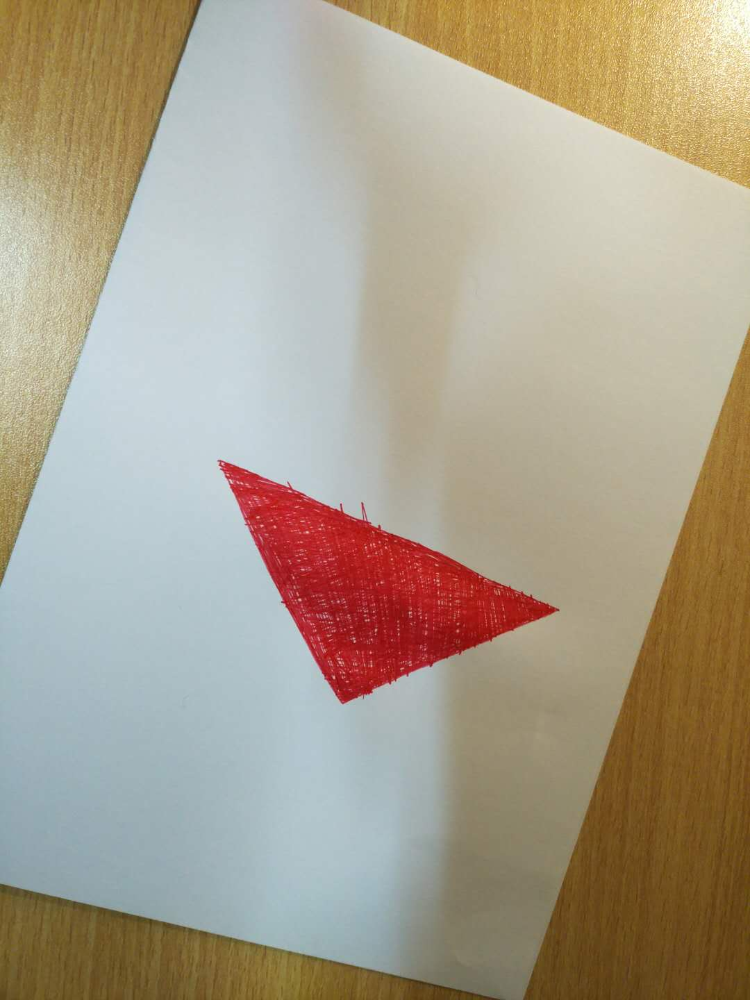

# 这才刚刚开始

恭喜你，已经通过了第一个，然而，一切才刚刚开始。

# 需求

给出三角形直角所指向方向的方向向量（区分正负）。

# 注意点：
- 真实光照
- 并不饱满的红色内区域
- 并不平滑的边缘

# 输入

这张图片

# 输出

在图像坐标系下，方向向量的坐标值，如：（仅示范格式，不代表最终结果）
> x: 1, y: -1

## 可选

在图片上形象地绘制方向向量。

## 最后

既然入了坑，就别轻易放弃！
